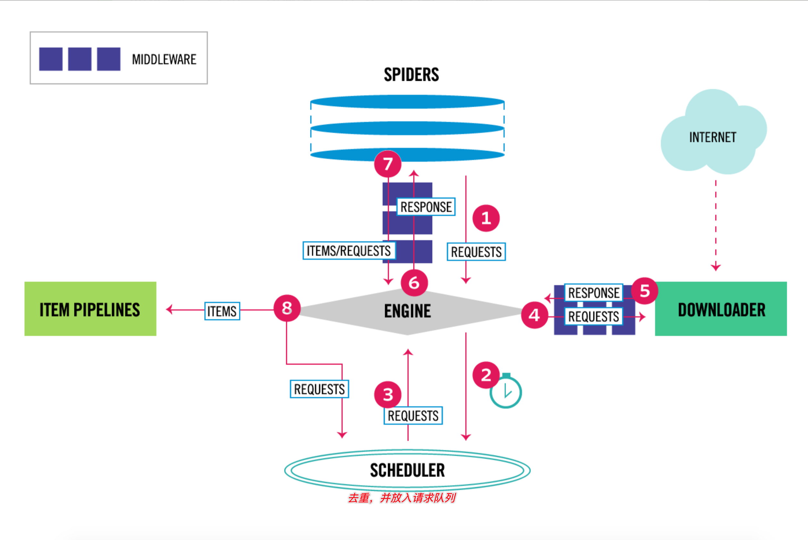

# 架构

## 5大核心组件
### Spiders(蜘蛛)
封装请求、解析数据。
### Engine(引擎)
控制整个爬虫系统的数据处理流程，并进行不同事务触发。
### Scheduler(调度器)
维护(包括去重)待爬取的URL队列，当调度程序从Scrapy Engine接受到请求时，会从待爬取的URL队列中取出下一个URL返还给他们。
### Downloader(下载器)
发送请求、获取响应
### Item Pipelines(管道)
数据清洗、持久化
# 快速开始
## 安装 pip install scrapy
## 创建项目
```
scrapy startproject demo

目录结构
./demo
├── demo
│   ├── __init__.py
│   ├── items.py
│   ├── middlewares.py
│   ├── pipelines.py
│   ├── settings.py
│   └── spiders
│       └── __init__.py
└── scrapy.cfg
```
## 创建爬虫
```
cd demo && scrapy genspider qiu_shi www.qiushibaike.com

Created spider 'qiu_shi' using template 'basic' in module:
  demo.spiders.qiu_shi
```
```python
import scrapy


class QiuShiSpider(scrapy.Spider):
    name = 'qiu_shi'
    allowed_domains = ['www.qiushibaike.com'] # start_urls中的连接的域名必须在allowed_domains，一般不需要该属性
    start_urls = ['http://www.qiushibaike.com']

    def parse(self, response):
        pass
```
## 修改配置 settings.py
1. 关闭robots协议
```
# Obey robots.txt rules
ROBOTSTXT_OBEY = False
```
2. 设置UserAgent
```
# Crawl responsibly by identifying yourself (and your website) on the user-agent
USER_AGENT = 'Mozilla/5.0 (Macintosh; Intel Mac OS X 10_15_5) ' \
             'AppleWebKit/537.36 (KHTML, like Gecko) Chrome/96.0.4664.110 Safari/537.36'
```
3. 设置日志等级为error
```
LOG_LEVEL = 'ERROR'
```
4. 开启管道功能，用于数据持久化
``` python
# Configure item pipelines
# See https://docs.scrapy.org/en/latest/topics/item-pipeline.html
ITEM_PIPELINES = {
   'demo.pipelines.JsonWriterPipeline': 300, # 数字约小优先级越高
}
```
## 数据解析
```
import scrapy

from demo.items import DemoItem


class QiuShiSpider(scrapy.Spider):
    name = 'qiu_shi'
    start_urls = ['https://www.qiushibaike.com/text/']

    def parse(self, response):
        divs = response.xpath("//div[contains(@id, 'qiushi_tag')]")
        for div in divs:
            auth = ''.join(div.xpath("./div/a/h2/text()").extract()).replace('\n', '')
            content = ''.join(div.xpath("./a[@class='contentHerf']/div/span/text()").extract()).replace('\n', '')
            item = DemoItem()
            item['auth'] = auth
            item['content'] = content
            yield item
```
## 运行爬虫
```
scrapy crawl qiu_shi
```